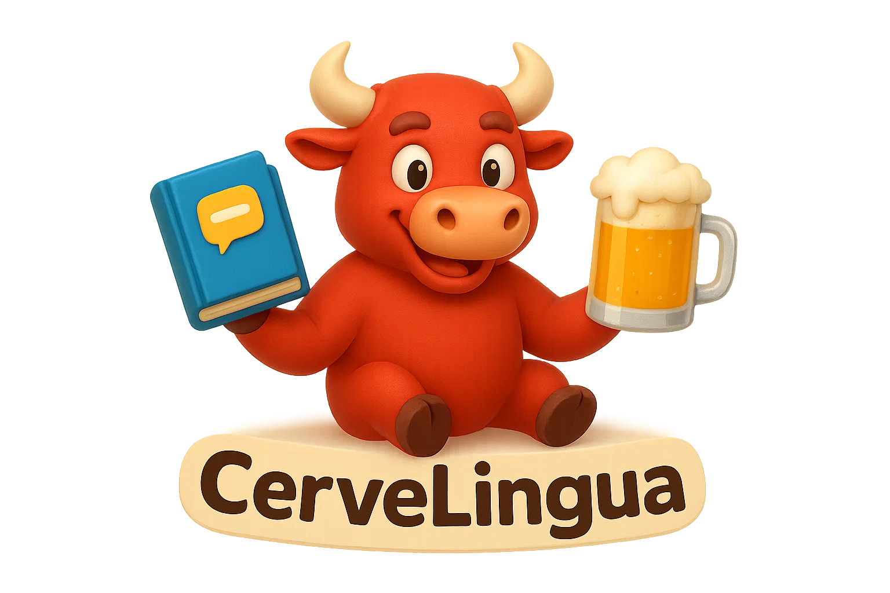

# CerveLingua - Your Interactive Spanish Learning Companion 🇪🇸🍻

> CerveLingua is a dynamic and engaging web platform designed to make learning Spanish fun, interactive, and effective. Dive into AI-powered conversations with our unique tutor, Cerve, sharpen your skills with engaging games, and track your progress as you journey from beginner (A1) to advanced (C1) fluency!

## ✨ Features

CerveLingua offers a rich set of features to cater to various learning styles and make your Spanish learning journey exciting:

*   🗣️ **AI-Powered Conversations with Cerve**:
    *   Practice real-world Spanish by chatting with **Cerve**, your witty, humorous, and exceptionally knowledgeable AI language tutor.
    *   Choose conversation topics like dining out, travel, hobbies, work, or daily life.
    *   Select your proficiency level (A1-C1) and conversation mode (free-flow, grammar focus, or vocabulary building).
    *   Receive gentle corrections, explanations, and interesting cultural tidbits in a natural, friendly way.
*   🎮 **Interactive Learning Games**:
    *   **Sentence Builder**: Test your grammar and vocabulary by arranging scrambled words to form correct Spanish sentences across various difficulty levels.
    *   **Speed Typing**: Improve your Spanish typing speed and accuracy with timed challenges.
    *   *(Coming Soon!)* **Pronunciation Trainer**: Utilize speech recognition to get feedback on your spoken Spanish, helping you refine your accent and intonation.
    *   *(Coming Soon!)* **Voice Command Adventure**: Navigate interactive stories and scenarios by speaking Spanish commands.
*   📸 **Visual Learning (Lernen mit Kamera)**:
    *   *(Under Development)* An innovative feature to learn Spanish vocabulary by identifying objects in your environment using your device's camera.
*   📈 **Comprehensive Progress Tracking**:
    *   Earn XP (Experience Points) for completing lessons, games, and conversations.
    *   Level up and see your Spanish skills grow.
    *   Monitor your scores, correct/incorrect answers, time spent, and overall accuracy.
*   🇪🇸 **Personalized & Adaptive Learning**:
    *   Content, challenges, and AI interactions are tailored to your selected proficiency level (A1 to C1).
    *   The platform adapts to help you focus on areas where you need improvement.
*   🌐 **User-Friendly & Responsive Interface**:
    *   Clean, intuitive design for a seamless learning experience.
    *   Fully responsive, allowing you to learn on your desktop, tablet, or mobile device.

## 📸 Sneak Peek of CerveLingua

Here's a glimpse of what CerveLingua offers. (Consider adding more screenshots of your actual platform!)

**AI Conversation Setup:**
*(Imagine a screenshot here showing the user selecting topic, level, and mode for AI chat)*
`<!--  -->`

**Sentence Builder Game in Action:**
*(Imagine a screenshot here showing the Sentence Builder game interface)*
`<!--  -->`

**User Dashboard / Progress:**
*(Imagine a screenshot here showing the user's dashboard with XP and level)*
`<!--  -->`

## 🚀 Technologies Powering CerveLingua

CerveLingua leverages a modern and robust technology stack:

*   **Backend Logic**: PHP
*   **Database**: PostgreSQL (for user data, progress, and content)
*   **Frontend Interactivity**: JavaScript, HTML5, CSS3
*   **AI Conversation Engine**: Ollama, supporting various local LLMs (e.g., Llama, Mistral, Gemma)
*   **Voice Capabilities (Planned)**: Web Speech API
*   **Styling & Icons**: Custom CSS, Font Awesome

## 🏁 Getting Started with CerveLingua

Embark on your Spanish learning adventure with CerveLingua!

1.  **Access the Platform**: Navigate to the CerveLingua website (once deployed).
2.  **Create Your Account**: Register for a new user profile or log in if you're returning.
3.  **Explore & Learn**:
    *   Head to the **AI Conversation** section to chat with Cerve.
    *   Visit the **Practice Games** area to play Sentence Builder or Speed Typing.
    *   (Soon) Try out the **Visual Learning** or **Voice Training** modules.
4.  **Customize Your Experience**: Always select the proficiency level and topic that suits your current learning goals.
5.  **Track Your Growth**: Keep an eye on your dashboard to see your XP and level increase!

## 🔮 Exciting Future Enhancements

We are passionate about making CerveLingua the ultimate Spanish learning tool. Here's what's on the horizon:

*   **Full Voice Integration**: Implementing robust speech-to-text and text-to-speech for the Pronunciation Trainer and Voice Command Adventures.
*   **Expanded Content Universe**: Continuously adding more vocabulary sets, grammar exercises, sentence challenges, cultural notes, and diverse AI conversation scenarios.
*   **Camera-Based Learning Launch**: Rolling out the fully functional "Lernen mit Kamera" module for interactive object-based vocabulary acquisition.
*   **Deeper Learning Analytics**: Providing users with more detailed insights into their strengths, weaknesses, and personalized learning recommendations.
*   **Community & Social Features**: Exploring options like leaderboards, study groups, or forums to foster a supportive learning community.

## 🤝 Contributing

CerveLingua is currently developed by a dedicated team. If you're passionate about language learning technology and have suggestions or feedback, please feel free to open an issue on this GitHub repository.

---

## 🎉 GET STARTED LEARNING!!! 🎉

**¡Empieza tu aventura con CerveLingua hoy y descubre lo divertido que puede ser aprender español!**
(Start your adventure with CerveLingua today and discover how fun learning Spanish can be!)